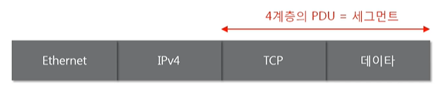
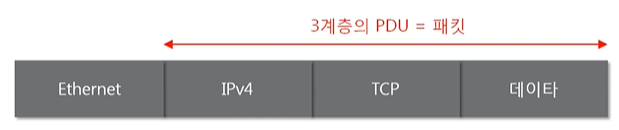
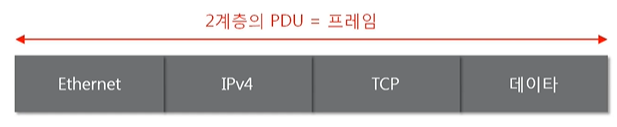

# 네트워크의 기준! 네트워크 모델

> "따라하면서 배우는 IT - 네트워크 기초(개정판)"을 듣고 정리한 내용입니다.
>
> https://www.youtube.com/playlist?list=PL0d8NnikouEWcF1jJueLdjRIC4HsUlULi

## 네트워크 계층 모델
### TCP/IP 모델
- 현재의 인터넷에서 컴퓨터들이 서로 정보를 주고받는데 쓰이는 통신 규약(프로토콜)의 모음
- 4계층 응용
- 3계층 전송
- 2계층 네트워크
- 1계층 네트워크 인터페이스

### OSI 7계층
- 데이터를 주고받을 때 데이터 자체의 흐름을 각 구간별로 나눠 놓은 것
- 7계층 응용
    - HTTP, SMTP, FTP, SSH
- 6계층 표현
- 5계층 세션
- 4계층 전송
    - TCP, UDP
- 3계층 네트워크
    - IP, ICMP, ARP
- 2계층 데이터 링크
    - 이더넷
- 1계층 물리

### 공통점과 차이점
- 공통점
    - 계층적 네트워크 모델
    - 계층간 역할 정의
- 차이점
    - 계층의 수 차이
    - OSI는 역할 기반, TCP/IP는 프로토콜 기반
    - OSI는 통신 전반에 대한 표준
    - TCP/IP는 데이터 전송기술 특화

## 네트워크를 통해 전달되는 데이터, 패킷
### 패킷이란?
- 패킷이란 네트워크 상에서 전달되는 데이터를 통칭하는 말로 네트워크에서 전달하는 데이터의 형식화된 블록이다.
- 패킷은 제어 정보와 사용자 데이터로 이루어지며 사용자 데이터는 페이로드라고도 한다.
- 여러 프로토콜들로 캡슐화 된 패킷

### 패킷을 이용한 통신과정 - 캡슐화
- 여러 프로토콜을 이용해서 최종적으로 보낼 때 패킷을 만드는 과정
     
    - 상위 계층에서부터 하위 계층으로 내려가면서 프로토콜을 붙임
    - 프로토콜을 붙일 때 상위 프로토콜이 하위 프로토콜 앞으로 올 수 없음

### 패킷을 이용한 통신과정 - 디캡슐화
- 패킷을 받았을 때 프로토콜들을 하나씩 확인하면서 데이터를 확인하는 과정
     

### 계층별 패킷의 이름 PDU
- 계층별로 이름이 다른 PDU(Protocol Data Unit)
     
     
     