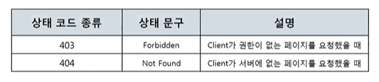
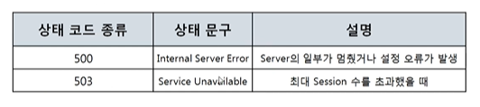

# www(웹)를 이용할 때는 이렇게 데이터를 주고받는다 - HTTP 응답 프로토콜의 구조

> "따라하면서 배우는 IT - 네트워크 기초(개정판)"을 듣고 정리한 내용입니다.
>
> https://www.youtube.com/playlist?list=PL0d8NnikouEWcF1jJueLdjRIC4HsUlULi

## HTTP 응답 프로토콜
### HTTP 응답 프로토콜의 구조
- 사용자가 볼 웹 페이지를 담고 있는 응답 프로토콜 구조
 
 
- Status Line
 
    - Request Line과 다르게 HTTP 버전이 가장 앞에 있음
- 서버가 알려주는 여러가지 정보 **상태 코드**
 
- 성공적인 통신 **200 OK**
 
- 클라이언트의 실수, 잘못, 오류 **400번대**
 
- 서버의 실수, 잘못, 오류 **500번대**
 