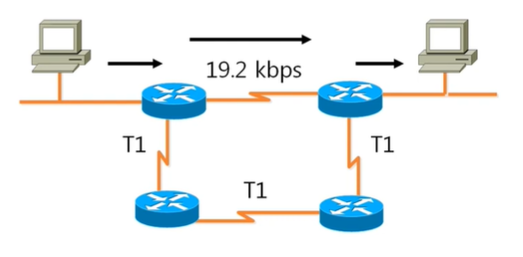
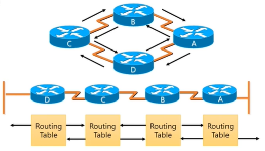

# 동적 라우팅 프로토콜 - RIP란

> "따라하면서 배우는 IT - 라우팅 & 스위칭 (개정판)"을 듣고 정리한 내용입니다.
>
> https://www.youtube.com/playlist?list=PL0d8NnikouEUYlR5BcG-YLbGvA5askt67

## RIP 라우팅 프로토콜
### RIP란?

 

- 목적지까지 가는데 라우터의 개수를 가지고 최적의 경로를 설정하는 프로토콜
- Distance Vector Routing Protocol
- v1과 v2가 있음
- Routing 정보 전송을 위해 UDP 포트 520번 사용
- AD값은 120

#### 장점
- 설정이 간단함
- 작은 규모의 네트워크나 대형 네트워크의 말단 지점에서 사용하기 좋음
- 표준 Routing Protocol이기 때문에 모든 회사의 Router에서 사용 가능

#### 단점
- Metric을 Hop-count로 사용함 (가장 적은 Hop-count를 가진 경로가 최적 경로)
    - 때문에 경로 결정시 Link의 속도를 반영하지 못함
    - 복잡한 네트워크에서는 비효율적인 Routing 경로가 만들어질 수 있음
- RIP의 최대 Hop-count가 15, 때문에 대형 네트워크에서는 사용이 불가능 (Hop-count가 16이면 도달 불가능한 네트워크로 간주)
- Routing 정보 전송 방식이 비효율적임
    - Topology에 변화와 상관없이 무조건 30초마다 인접 Router에게 Routing table 내용 전체를 전송함 (OSPF, EIGRP, BGP 등의 다른 Dynamic Routing Protocol은 Topology 변화가 생길 경우 바뀐 네트워크의 정보만 전송)

#### Convergence(수렴) Time
- Convergence -> 네트워크에 변화가 생길 경우 모든 Router가 네트워크 변화 상태에 대해 정확하고 일관된 정보를 유지하는 것
- Convergence Time -> 네트워크에 변화가 생겼을 경우 그 변화된 정보를 서로 인식하고 수정하는 시간
    - Convergence Time은 각 Routing Protocol별로 다름
    - Convergence Time이 짧을수록 좋음
- RIP 같은 경우는 Convergence Time이 30초로 느림
    - Routing Loop 문제가 발생함

## 라우팅 정보 공유 방법

 
 