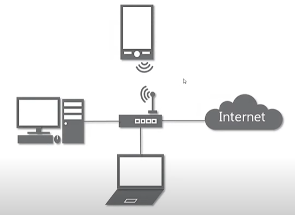
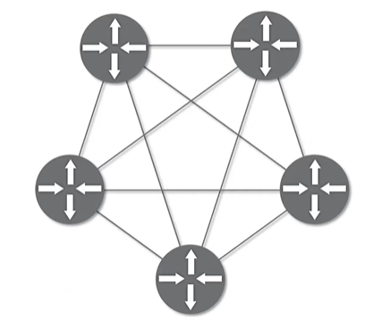
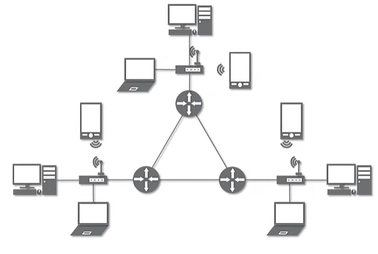

# 네트워크란 무엇인가?

> "따라하면서 배우는 IT - 네트워크 기초(개정판)"을 듣고 정리한 내용입니다.
>
> https://www.youtube.com/playlist?list=PL0d8NnikouEWcF1jJueLdjRIC4HsUlULi

## 네트워크란 무엇인가?
- 노드들이 데이터를 공유할 수 있게 하는 디지털 전기통신망의 하나이다.
- 즉, 분산되어 있는 컴퓨터를 통신망으로 연결한 것을 말한다.
- 네트워크에서 여러 장치들을 노드 간 연결을 사용하여 서로에게 데이터를 교환한다.

## 인터넷이란?
- 문서, 그림 영상과 같은 여러가지 데이터를 공유하도록 구성된 세상에서 가장 큰 전세계를 연결하는 네트워크

## 네트워크의 분류
### 크기에 따른 분류
- LAN(Local Area Network)
    - LAN은 가까운 지역을 하나로 묶은 네트워크
- WAN(Wide Area Network)
    - WAN은 멀리 있는 지역을 한데 묶은 네트워크
    - 가까운 지역끼리 묶인 LAN과 LAN을 다시 하나로 묶은 것
- MAN

### 연결 형태에 따른 분류
- 중앙 장비에 모든 노드가 연결된 Star형
     
- 여러 노드들이 서로 그물처럼 연결된 Mesh형
     
- 마치 나무의 가지처럼 계층 구조로 연결된 Tree형
- 링형
- 버스형
- 혼합형
     

## 네트워크의 통신 방식
### 네트워크에서 데이터는 어떻게 주고 받는가?
- 특정 대상이랑만 1:1로 통신하는 유니 캐스트
- 특정 다수와 1:N으로 통신하는 멀티 캐스트
- 네트워크에 있는 모든 대상과 통신하는 브로드 캐스트

## 네트워크 프로토콜
### 프로토콜이란?
- 프로토콜은 일종의 약속, 양식
- 네트워크에서 노드와 노드가 통신할 때 어떤 노드가 어느 노드에게 어떤 데이터를 어떻게 보내는지 작성하기 위한 양식

### 여러가지 프로토콜
- 가까운 곳과 연락할 때
    - Ethernet 프로토콜
    - (MAC 주소)
- 멀리 있는 곳과 연락할 때
    - ICMP
    - IPv4
    - ARP
    - (IP 주소)
- 여러가지 프로그램으로 연락할 때
    - TCP, UDP
    - (포트 번호)
- 여러 프로토콜들로 캡슐화 된 <b>패킷</b>